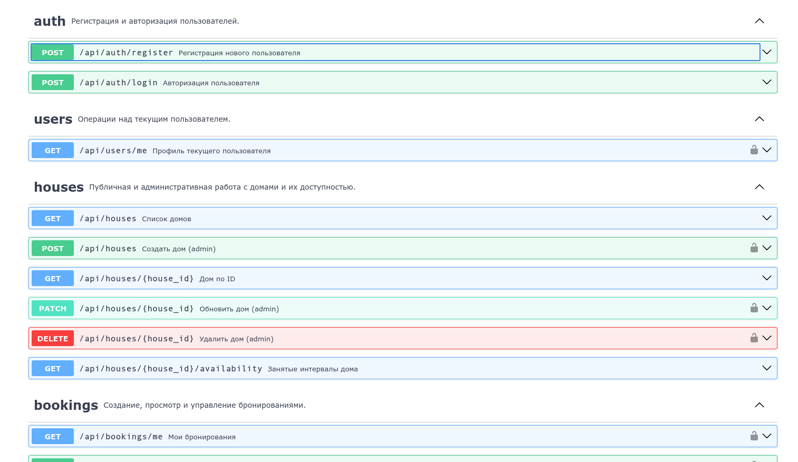

# 🏠 HouseBooking

**Современная full-stack платформа для поиска, выбора и бронирования домов — быстро, прозрачно и удобно.**

<p align="left">
  
  
</p>

---

## 🎬 Screenshot / Demo



🔗 **Live Demo:** [https://your-demo-link.example.com](https://your-demo-link.example.com)

> Добавьте актуальный GIF или скриншот интерфейса в `docs/screenshot.png`, чтобы сразу показать UX проекта новым пользователям.

---

## 📖 Overview

**HouseBooking** — это веб-приложение для бронирования домов и объектов размещения с понятным пользовательским интерфейсом и API-first архитектурой.

---

## ✨ Features

- 🏘️ Просмотр каталога домов с быстрым доступом к карточке каждого объекта.
- 📅 Проверка доступности по датам через отдельный endpoint занятых интервалов.
- 🔐 JWT-аутентификация: регистрация и вход с выдачей access token.
- 👤 Личный кабинет пользователя с просмотром собственных бронирований.
- 🧾 Создание и отмена бронирований пользователем.
- 🛡️ Ролевая модель (client/admin) для разделения пользовательских и админских прав.
- 🧑‍💼 Админ-функции: создание, редактирование и удаление домов.
- ✅ Админ-модерация бронирований (подтверждение/отмена).
- 📡 REST API с OpenAPI/Swagger-документацией «из коробки».
- 📱 Адаптивный интерфейс на Vue 3 для комфортного использования с разных устройств.
- ⚡ Быстрый DX: Vite для фронтенда и Uvicorn для запуска API.

---

## 🛠️ Tech Stack

| Layer | Technologies |
|---|---|
| **Frontend** |     |
| **Backend** |    |
| **Database** |    |
| **Auth & Security** |  Password Hashing |
| **Dev Tools** |   |

---

## 🔐 Environment Variables

Ниже перечислены ключевые переменные окружения для backend и frontend.

| Variable | Scope | Description | Example |
|---|---|---|---|
| `DB_HOST` | Backend | Хост PostgreSQL | `localhost` |
| `DB_PORT` | Backend | Порт PostgreSQL | `5432` |
| `DB_USER` | Backend | Пользователь БД | `postgres` |
| `DB_PASS` | Backend | Пароль БД | `postgres` |
| `DB_NAME` | Backend | Имя базы данных | `housebooking` |
| `APP_NAME` | Backend | Название API в OpenAPI | `Houses Booking API` |
| `JWT_SECRET_KEY` | Backend | Секрет для подписи JWT | `super-secret-key` |
| `JWT_ALGORITHM` | Backend | Алгоритм JWT | `HS256` |
| `ACCESS_TOKEN_EXPIRE_MINUTES` | Backend | Время жизни access token | `30` |
| `VITE_API_URL` | Frontend | Базовый URL API | `http://127.0.0.1:8000/api` |

> ⚠️ Никогда не коммитьте реальные секреты в репозиторий. Используйте `.env` и менеджеры секретов в production.

---

## 📂 Project Structure

```text
HouseBooking/
├── backend/
│   ├── alembic/
│   │   └── versions/
│   ├── app/
│   │   ├── api/
│   │   │   ├── routes/
│   │   │   │   ├── auth.py
│   │   │   │   ├── bookings.py
│   │   │   │   ├── houses.py
│   │   │   │   └── users.py
│   │   │   ├── deps.py
│   │   │   └── routers.py
│   │   ├── core/
│   │   ├── crud/
│   │   ├── db/
│   │   ├── models/
│   │   ├── schemas/
│   │   └── main.py
│   ├── requirements.txt
│   └── alembic.ini
├── frontend/
│   └── frontend/
│       ├── src/
│       │   ├── api/
│       │   ├── components/
│       │   ├── router/
│       │   └── views/
│       ├── package.json
│       └── vite.config.js
├── docs/
│   ├── screenshot.png
│   └── swagger-placeholder.png
└── README.md
```

---

## 📡 API Documentation

FastAPI автоматически генерирует интерактивную документацию API:

- **Swagger UI:** `http://127.0.0.1:8000/docs`
- **ReDoc:** `http://127.0.0.1:8000/redoc`

В Swagger вы можете:

- просматривать схемы запросов/ответов;
- тестировать endpoint'ы прямо из браузера;
- авторизоваться через Bearer Token для защищённых ручек.


---

<p align="center">
  Сделано с ❤️ для сообщества разработчиков и будущих путешественников.
</p>
# 🏠 HouseBooking
